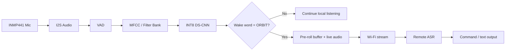

# ORBIT — Low Latency and Efficient Voice Activator for Edge Devices

Smart India Hackathon 2026 | PS ID: 26172 | Theme: Smart Automation | Category: Hardware | Team NeuraLink

> Detect locally. Stream only when needed.

ORBIT is an edge-first voice activation system designed for low-power IoT devices. An ESP32-S3 continuously performs lightweight local processing and detects a custom wake word, ORBIT, without continuously sending microphone audio to the cloud. Once the wake word is detected, ORBIT combines a short pre-roll buffer with live audio and streams only the relevant segment over Wi-Fi to a remote ASR pipeline.

This repository contains the interactive online technical lab and demo website for the project. It is intended to complement the SIH technical slide, showcase the architecture, and explain the concept visually without requiring a backend.

---

## 1. Problem Statement

Traditional cloud-first voice interfaces often depend on continuous network transmission for always-on listening. This can add:

- unnecessary bandwidth usage
- network-dependent latency
- privacy concerns around ambient audio
- higher power consumption in edge devices

ORBIT separates the task into two stages:

- Edge: detect whether the user said the wake word locally
- Remote ASR: perform the heavier speech-to-text task only after activation

This creates an efficient hybrid architecture where the device listens locally and the network is used only when interaction is detected.

---

## 2. Core Solution

```text
INMP441
   ↓
I2S Audio
   ↓
VAD
   ↓
MFCC / Filter Bank
   ↓
INT8 DS-CNN
   ↓
Custom KWS: "ORBIT"
   │
   ├── No detection → continue local listening
   │
   └── Detection → pre-roll + live audio
                         ↓
                       Wi‑Fi
                         ↓
                    Remote ASR
                         ↓
                  Text / command
```

The design is intended to be lightweight, customizable, and suitable for TinyML-style deployment on compact embedded hardware.

---

## 3. Key Hardware Components

| Component | Purpose |
| --- | --- |
| ESP32-S3 DevKitC-1 | Edge processing, local inference, Wi‑Fi communication |
| INMP441 | I2S digital microphone |
| USB Type-C | Power and programming |
| Status LED | Wake word / Wi‑Fi / system indication |
| User button | Reset or mode interaction |
| 3D-printed enclosure | Compact portable housing |

Reference prototype dimensions are approximately 75 × 45 × 28 mm. These are concept dimensions and should be verified before manufacturing.

---

## 4. System Architecture



---

## 5. Demo Website Features

This repository includes a static technical website that demonstrates:

- edge-to-cloud architecture flow
- interactive 3D-style hardware viewer
- real hardware reference photos
- circuit reference and GPIO mapping
- browser-based benchmark simulator
- live voice-pipeline simulation
- responsive dark technical UI

The site is intentionally designed to be easy to host on static infrastructure with no backend.

---

## 6. Accuracy and Measurement Notice

This website is a technical explainer and simulation, not a substitute for actual hardware validation.

Important:

- the site uses supplied real photos as hardware references
- benchmark values are shown as engineering target or simulation values
- values must not be described as measured physical results unless they are backed by real ESP32-S3 logs

Examples of simulation-only values include latency, RAM, power, and false activation metrics shown in the browser harness.

Before claiming a metric as measured, document:

- device revision
- firmware version
- model version
- dataset/test-set version
- environment
- measurement method
- date

---

## 7. Performance Goals

The project defines the following engineering targets:

| Metric | Target |
| --- | --- |
| RAM footprint | < 256 KB |
| Idle CPU | < 10% |
| Keyword TPR | ≥ 95% |
| False activations | ≤ 1/hour |
| KWS latency | < 200 ms |
| Keyword → ASR receive | < 500 ms |

These are target values only and not automatically validated measurements.

---

## 8. Hardware Wiring Reference

The supplied circuit reference uses the following pin mapping:

- INMP441 VDD → 3.3V
- INMP441 GND → GND
- INMP441 WS / LRCLK → GPIO 12
- INMP441 SCK / BCLK → GPIO 13
- INMP441 SD / DATA → GPIO 14
- Optional status LED → configurable GPIO output

Important: GPIO12/13/14 are design choices shown in the supplied reference. Verify the exact mapping for the selected ESP32-S3 board revision before powering the circuit.

---

## 9. Local Demo Setup

This project is fully static and does not require a backend.

### Option 1: Python HTTP server

```bash
cd ORBIT_online_technical_lab
python -m http.server 8000
```

Then open:

```text
http://localhost:8000
```

### Option 2: Open directly in browser

You can also open `index.html` directly in a browser, though a local HTTP server is preferred for consistent behavior.

---

## 10. Deployment

Upload the project folder to any static hosting provider such as:

- Vercel
- Netlify
- GitHub Pages
- Cloudflare Pages

No backend or server-side runtime is required for the demo site.

---

## 11. Repository Structure

```text
ORBIT_online_technical_lab/
├── index.html
├── README.md
├── concept_prototype.png
├── circuit_reference.png
├── real_breadboard.jpg
├── real_enclosure.jpg
└── assets/ (if added during customizations)
```

---

## 12. Demo Storyboard

A 100-second SIH demo can be structured as:

1. Problem / motivation
2. Hardware reveal
3. Local microphone listening
4. VAD + MFCC + INT8 DS-CNN
5. ORBIT detected
6. Pre-roll buffer
7. Wi‑Fi audio streaming
8. Remote ASR
9. End-to-end command demo
10. Final dashboard / architecture summary

Suggested closing line:

> Detect locally. Stream only when needed.

---

## 13. Privacy and Production Considerations

The intended architecture minimizes unnecessary transmission of ambient audio:

- before wake word: local processing only
- after wake word: pre-roll + live audio sent for ASR

This is privacy-oriented by design, but production deployments should still address:

- secure credential handling
- encrypted transport
- device identity and authentication
- payload validation
- data retention limits
- secure server logging and access control

---

## 14. Final Pitch Line

> ORBIT keeps the always-on intelligence at the edge and uses the network only when the user actually asks for it.

---

## 15. Project Identity

- Project: ORBIT
- Expansion: Low Latency and Efficient Voice Activator for Edge Devices
- Hackathon: Smart India Hackathon 2026
- PS ID: 26172
- Team: NeuraLink
- Primary edge device: ESP32-S3
- Microphone: INMP441
- Wake word: ORBIT
- Model direction: INT8 DS-CNN
- Architecture: Edge KWS + post-wake remote ASR

---

## 16. Notes

This repository is a presentation and concept demo for the ORBIT system. It visually communicates the intended architecture and engineering workflow, while clearly distinguishing simulation values from physically verified hardware results.
